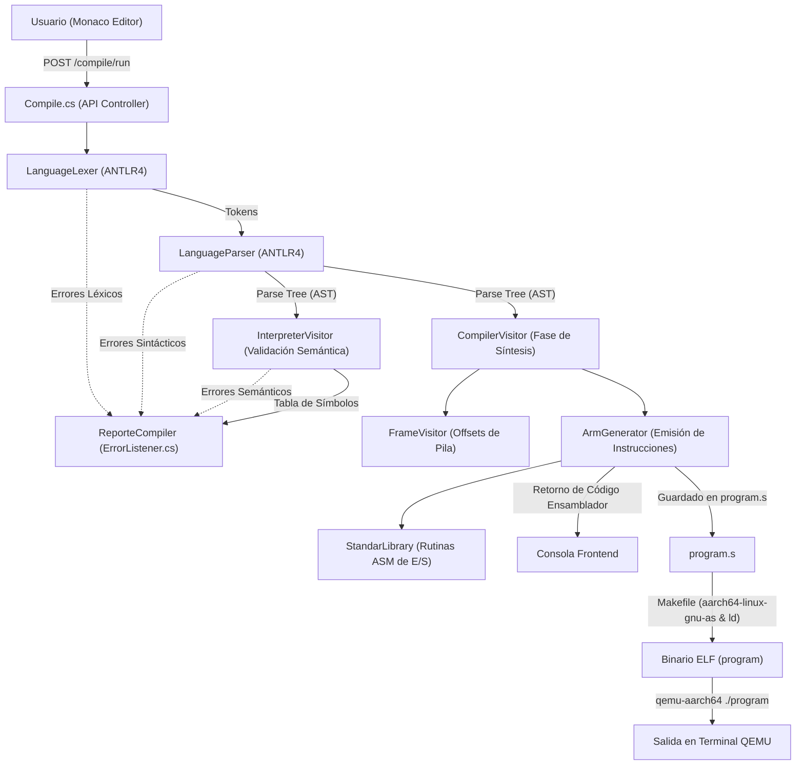
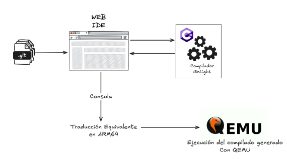

# GoLight - Compilador a ARM64 y Entorno de Ejecución

Proyecto desarrollado para el curso **Organización de Lenguajes y Compiladores 2** (USAC - Carné: 201700700).

**GoLight** es un compilador e intérprete para un subconjunto del lenguaje de programación **Go (Golang)** con generación de código objeto en ensamblador **ARM64 (AArch64)** dirigido a la arquitectura **Cortex-A57**. El sistema cuenta con una arquitectura desacoplada que incluye un frontend interactivo en **Next.js / React** con editor de código y consola, y un backend en **ASP.NET Core (.NET 9.0)** que utiliza **ANTLR4**, el patrón de diseño **Visitor** para el análisis léxico, sintáctico, semántico y un generador de código ensamblador ejecutable en entornos **GNU/Linux** o emulado mediante **QEMU**.

---

## Tabla de Contenidos

1. [Arquitectura General](#arquitectura-general)
2. [Requisitos y Tecnologías](#requisitos-y-tecnologías)
3. [Estructura del Repositorio](#estructura-del-repositorio)
4. [Instrucciones de Instalación y Ejecución](#instrucciones-de-instalación-y-ejecución)
5. [Flujo de Compilación y Síntesis a ARM64](#flujo-de-compilación-y-síntesis-a-arm64)
6. [Gramática y Características del Lenguaje](#gramática-y-características-del-lenguaje)
7. [Componentes del Backend y Generador ARM64](#componentes-del-backend-y-generador-arm64)
8. [Arquitectura de Memoria y Registros ARM64](#arquitectura-de-memoria-y-registros-arm64)
9. [Interfaz de Usuario y Reportes](#interfaz-de-usuario-y-reportes)

---

## Arquitectura General

El sistema está dividido en dos capas principales y una etapa final de ejecución en bajo nivel:

- **Frontend (Cliente Web)**: Desarrollado con **Next.js 15**, **React 19**, **TypeScript**, **Tailwind CSS**, **Monaco Editor** y **SweetAlert2**. Proporciona un IDE web con resaltado de sintaxis, apertura de archivos, consola de visualización para el código ensamblador resultante y diálogos modales para reportes de errores, tabla de símbolos y árbol sintáctico (AST).
- **Backend (API REST y Compilador)**: Desarrollado en **C# (.NET 9.0)** con **ASP.NET Core Web API**. Integra **ANTLR4** para la generación del analizador léxico y sintáctico a partir de `Language.g4`. Implementa una fase de interpretación semántica con `InterpreterVisitor` y una fase de síntesis con `CompilerVisitor` y `ArmGenerator`, traduciendo el código fuente GoLight a instrucciones **ARM64**.
- **Capa de Ejecución ARM64 / QEMU**: El código ensamblador generado (`program.s`) se ensambla y enlaza mediante herramientas GNU (`aarch64-linux-gnu-as`, `aarch64-linux-gnu-ld`) controladas por un `Makefile`, generando un ejecutable binario ELF que puede ser ejecutado directamente en hardware ARM64 o mediante el emulador **QEMU User** (`qemu-aarch64`).

---

## Requisitos y Tecnologías

### Requisitos Previos
- **.NET SDK 9.0** o superior.
- **Node.js** (v18 o superior) y gestor de paquetes (`npm` o `pnpm`).
- **Java Runtime Environment (JRE)** (necesario si se recompila la gramática con la herramienta ANTLR4 CLI).
- **Herramientas de Ensamblado y Emulación ARM64** (para compilar y ejecutar el binario generado):
  - `aarch64-linux-gnu-as` (GNU Assembler para AArch64)
  - `aarch64-linux-gnu-ld` (GNU Linker para AArch64)
  - `qemu-user` o `qemu-aarch64` (Emulador de modo usuario)

> En sistemas basados en Debian/Ubuntu:
> ```bash
> sudo apt-get update
> sudo apt-get install -y gcc-aarch64-linux-gnu binutils-aarch64-linux-gnu qemu-user
> ```

### Tecnologías Principales
| Componente | Tecnología |
| :--- | :--- |
| **Backend Framework** | ASP.NET Core 9.0 Web API |
| **Generador de Parser** | ANTLR4 (`Language.g4` / Runtime C# 4.13.1) |
| **Arquitectura Objetivo** | ARM64 / AArch64 (Cortex-A57) |
| **Frontend Framework** | Next.js 15 (App Router) + React 19 |
| **Editor de Código** | `@monaco-editor/react` (Monaco Editor) |
| **Estilos & UI** | Tailwind CSS + SweetAlert2 |
| **Cadena de Enlace** | GNU Binutils AArch64 + Makefile |

---

## Estructura del Repositorio

```text
OLC2_Proyecto2_201700700/
├── backend/
│   ├── Controllers/
│   │   └── Compile.cs            # Controlador API (endpoints /run, /error, /symbols, /ast)
│   ├── analyzer/                 # Clases generadas por ANTLR4 (Lexer, Parser, BaseVisitor)
│   ├── compiler/                 # Módulo de compilación y generación ARM64
│   │   ├── arm/
│   │   │   ├── Generator.cs      # ArmGenerator: emisión de instrucciones y pila/heap
│   │   │   ├── Registers.cs      # Mapeo y enumeración de registros ARM64
│   │   │   ├── Std.cs            # StandarLibrary: rutinas nativas en ASM (print_*, etc.)
│   │   │   └── Utils.cs          # Utilidades para strings y conversión de bytes
│   │   ├── CompilerVisitor.cs    # Evaluador AST y traductor a código máquina ARM64
│   │   └── FrameVisitor.cs       # Cálculo de stack frames y offsets locales
│   ├── interpreter/              # Intérprete y validación semántica en memoria
│   │   ├── Embeded.cs            # Funciones embebidas (fmt.Println, strconv, reflect)
│   │   ├── Enviroment.cs         # Gestión de entornos y ámbitos léxicos (Scopes)
│   │   ├── ErrorListener.cs      # Captura de errores (Léxico, Sintáctico, Semántico) y Símbolos
│   │   ├── Foreign.cs            # Invocación de funciones de usuario y métodos de structs
│   │   ├── Invocable.cs          # Interfaz base de objetos invocables
│   │   ├── Struct.cs             # Tipos y valores de estructuras
│   │   ├── TransferValues.cs     # Excepciones de control de flujo (break, continue, return)
│   │   ├── ValueWrapper.cs       # Jerarquía de tipos de datos en runtime
│   │   └── InterpreterVisitor.cs # Evaluador AST para ejecución semántica en memoria
│   ├── Language.g4               # Gramática léxica y sintáctica en ANTLR4
│   ├── Program.cs                # Punto de entrada de ASP.NET Core y CORS
│   └── backend.csproj
├── frontend/
│   ├── src/
│   │   └── app/
│   │       ├── page.tsx          # Vista principal (Editor, Consola, Botones y Modales)
│   │       ├── layout.tsx
│   │       └── globals.css
│   ├── package.json
│   └── tailwind.config.ts
├── docs/
│   ├── assets/                   # Diagramas y capturas de pantalla de la interfaz
│   ├── prueba/                   # Archivos de prueba en GoLight (.glt)
│   │   ├── basico.glt
│   │   ├── funciones.glt
│   │   └── intermedias.glt
│   ├── tecnico.md                # Documentación técnica
│   └── usuario.md                # Manual de usuario
├── Makefile                      # Reglas de ensamble y enlace para ARM64
├── program.s                     # Código ensamblador ARM64 generado
└── README.md
```

---

## Instrucciones de Instalación y Ejecución

### 1. Clonar el repositorio
```bash
git clone https://github.com/fernandofalla/OLC2_Proyecto1_201700700.git
cd OLC2_Proyecto1_201700700
```

### 2. Ejecutar el Backend
En una terminal, ingrese al directorio del backend e inicie el servidor Web API:
```bash
cd backend
dotnet restore
dotnet run
# o alternativamente con recarga en caliente:
dotnet watch run
```
El backend iniciará por defecto en `http://127.0.0.1:5201`.

### 3. Ejecutar el Frontend
En otra terminal, ingrese al directorio del frontend, instale las dependencias e inicie el entorno Next.js:
```bash
cd frontend
npm install
npm run dev
```
Abra su navegador en [http://localhost:3000](http://localhost:3000).

### 4. Ensamblado y Ejecución del Binario ARM64
Una vez generado el código ensamblador desde la interfaz web, el contenido se guarda en `program.s` en la raíz del proyecto. Para ensamblarlo, enlazarlo y ejecutarlo:

```bash
# 1. Ensamblar y enlazar con Makefile
make

# 2. Ejecutar el binario generado mediante QEMU
qemu-aarch64 ./program

# 3. Limpiar archivos generados (.o y binario)
make clean
```

---

## Flujo de Compilación y Síntesis a ARM64



1. **Recepción del Código Fuente**: La interfaz web envía el código GoLight a la ruta `POST /compile/run`.
2. **Análisis Léxico y Sintáctico**:
   - `LanguageLexer` tokeniza la entrada y captura errores con `LexicalError`.
   - `LanguageParser` valida la gramática y crea el árbol sintáctico, capturando errores sintácticos con `SyntaxErrorListener`.
3. **Fase de Validación Semántica e Interpretación**:
   - `InterpreterVisitor` valida la coherencia de tipos, ámbitos de variables (`Environment`) y recolecta los símbolos declarados para el reporte.
4. **Fase de Síntesis y Generación ARM64**:
   - `CompilerVisitor` recorre el AST.
   - `FrameVisitor` calcula los espacios requeridos en el marco de pila (*stack frame*) para variables locales y parámetros.
   - `ArmGenerator` emite instrucciones de bajo nivel (`MOV`, `STR`, `LDR`, `ADD`, `SUB`, `CMP`, `B.EQ`, `BL`, etc.).
   - Se inyectan las rutinas de soporte en ensamblador desde `StandarLibrary` (impresión de enteros, flotantes, booleanos y cadenas).
5. **Ensamblado y Enlace**:
   - El código generado se ensambla con `aarch64-linux-gnu-as` y se enlaza con `aarch64-linux-gnu-ld` produciendo el ejecutable final `program`.

---

## Gramática y Características del Lenguaje

El lenguaje **GoLight** implementa las siguientes construcciones sintácticas y semánticas definidas en `Language.g4`:

### 1. Tipos de Datos Soportados
- **Primitivos**: `int`, `float64`, `string`, `bool`, `rune` (`'c'`), `nil`.
- **Compuestos**:
  - **Slices (Arreglos unidimensionales dinámicos)**: `[]tipo`
  - **Matrices (Arreglos bidimensionales)**: `[][]tipo`
  - **Estructuras (Structs)**: `type Nombre struct { ... }`

### 2. Declaración y Asignación de Variables
```go
// Declaración explícita con y sin valor inicial
var edad int = 25;
var promedio float64;
var activo bool = true;

// Declaración corta / implícita (inferencia de tipo)
mensaje := "Hola Mundo";
contador := 0;

// Declaración e inicialización de Slices
numeros := []int{10, 20, 30, 40};
var lista []string;

// Declaración e inicialización de Matrices
matriz := [][]int{{1, 2, 3}, {4, 5, 6}};

// Declaración de Structs e Instanciación
type Persona struct {
    nombre string;
    edad int;
};

Persona p = { nombre: "Carlos", edad: 30 };
```

### 3. Estructuras de Control de Flujo
```go
// Condicional if - else
if edad >= 18 {
    fmt.Println("Mayor de edad");
} else {
    fmt.Println("Menor de edad");
}

// Selección switch - case - default
switch opcion {
    case 1:
        fmt.Println("Opcion 1 seleccionada");
    case 2:
        fmt.Println("Opcion 2 seleccionada");
    default:
        fmt.Println("Opcion invalida");
}

// Bucle for simple (estilo while)
for contador < 5 {
    fmt.Println(contador);
    contador++;
}

// Bucle for clásico (3 partes)
for var i int = 0; i < 10; i++ {
    if i == 5 {
        continue;
    }
    fmt.Println(i);
}

// Bucle for range (iteración de colecciones)
for idx, valor := range numeros {
    fmt.Println(idx);
    fmt.Println(valor);
}
```

### 4. Funciones y Métodos
```go
// Función con parámetros y valor de retorno
func sumar(a int, b int) int {
    return a + b;
}

// Función sin retorno (void)
func saludar(nombre string) {
    fmt.Println("Hola " + nombre);
}

// Método asociado a una estructura (Struct Method)
func (p Persona) celebrarCumpleanos() {
    p.edad = p.edad + 1;
    fmt.Println(p.edad);
}
```

### 5. Operaciones y Expresiones
- **Aritméticas**: Suma `+`, Resta `-`, Multiplicación `*`, División `/`, Módulo `%`, Negación unaria `-`.
- **Incremento y Decremento**: `variable++`, `variable--`.
- **Relacionales e Igualdad**: `<`, `<=`, `>`, `>=`, `==`, `!=`.
- **Lógicas**: Conjunción `&&`, Disyunción `||`, Negación `!`.
- **Acceso y Modificación**:
  - Elementos de slice: `numeros[0] = 50`
  - Elementos de matriz: `matriz[0][1] = 99`
  - Atributos de estructuras: `p.nombre = "Ana"`

### 6. Funciones Nativas y Embebidas
| Función / Paquete | Descripción | Ejemplo |
| :--- | :--- | :--- |
| `fmt.Println(expr)` | Imprime valores en la salida estándar con salto de línea | `fmt.Println("Total:", total)` |
| `len(coleccion)` | Retorna la longitud de un slice o matriz | `len(numeros)` |
| `append(slice, val)` | Agrega un elemento al final de un slice | `numeros = append(numeros, 50)` |
| `slices.Index(s, val)` | Retorna el índice de un elemento en un slice | `slices.Index(numeros, 20)` |
| `strings.Join(s, sep)` | Une los elementos de un slice de cadenas con un separador | `strings.Join(palabras, "-")` |
| `strconv.Atoi(str)` | Convierte una cadena a entero | `val := strconv.Atoi("123")` |
| `strconv.ParseFloat(s)` | Convierte una cadena a decimal (`float64`) | `val := strconv.ParseFloat("3.14")` |
| `reflect.TypeOf(val)` | Devuelve el nombre del tipo de dato en string | `tipo := reflect.TypeOf(edad)` |

---

## Componentes del Backend y Generador ARM64

### Módulo del Compilador (`backend/compiler/`)

1. **`CompilerVisitor.cs`**:
   - Hereda de `LanguageBaseVisitor<Object?>`.
   - Visita cada nodo del AST y traduce declaraciones de variables, expresiones aritméticas/lógicas, estructuras de control (`if`, `for`, `switch`) y llamadas a funciones a código ensamblador ARM64.
2. **`FrameVisitor.cs`**:
   - Analiza los bloques de código y funciones antes de la emisión final para determinar el tamaño requerido del marco de pila (*stack frame*) y calcular el *offset* relativo de cada variable local.
3. **`arm/Generator.cs` (`ArmGenerator`)**:
   - Abstracción de alto nivel para emitir instrucciones ARM64 (`Mov`, `Add`, `Sub`, `Mul`, `Sdiv`, `Cmp`, `B`, `Beq`, `Bne`, `Blt`, `Bgt`, `Str`, `Ldr`, `Push`, `Pop`, etc.).
   - Administra el modelo de pila simulada (`StackObject`) y el puntero de Heap (`HP` / `x10`).
4. **`arm/Registers.cs`**:
   - Define los registros de 64 bits (`X0` a `X30`), 32 bits (`W0` a `W30`), registros flotantes SIMD/FP (`D0` a `D31`), el puntero de pila (`SP`) y el registro de Heap (`HP`).
5. **`arm/Std.cs` (`StandarLibrary`)**:
   - Proporciona rutinas reutilizables en ensamblador puro ARM64 para:
     - `print_integer`: Impresión de enteros positivos y negativos con conversión a ASCII y llamada a `sys_write`.
     - `print_double`: Impresión de números decimales de punto flotante de 64 bits con parte entera y fraccionaria.
     - `print_boolean`: Impresión de literales `true` y `false`.
     - `print_string`: Recorrido de cadenas en memoria hasta el terminador nulo o longitud calculada.
     - `concat_cadena`: Concatenación de cadenas en el Heap.
6. **`arm/Utils.cs`**:
   - Rutinas de conversión de cadenas a arreglos de bytes y formateo auxiliar.

---

## Arquitectura de Memoria y Registros ARM64

El código ensamblador generado implementa el modelo de ejecución para arquitecturas ARM64 (AArch64):

### 1. Mapa de Memoria
- **Sección de Datos (`.data`)**:
  - `heap: .space 4096`: Reserva un búfer estático de 4KB en memoria para asignaciones dinámicas (strings, arreglos, structs).
  - Etiquetas y constantes literales para cadenas del sistema (`newline_char`, `minus_sign`, `dot_char`, `true_str`, `false_str`).
- **Sección de Código (`.text`)**:
  - Punto de entrada principal `_start:`.
  - Inicialización del puntero de Heap: `ADR x10, heap`.
  - Cuerpo de instrucciones del programa compilado.
  - Rutinas de la librería estándar al final del archivo.

### 2. Uso de Registros
| Registro | Función en GoLight |
| :--- | :--- |
| **`x0` / `w0`** | Registro acumulador, paso de argumentos primarios y códigos de retorno |
| **`x1` - `x7`** | Paso de parámetros y registros de cálculo temporal |
| **`x10` (`HP`)** | **Heap Pointer**: Puntero a la siguiente dirección libre en el montículo |
| **`x29` (`FP`)** | **Frame Pointer**: Puntero base del marco de pila de la función actual |
| **`x30` (`LR`)** | **Link Register**: Almacena la dirección de retorno de llamadas `BL` |
| **`sp`** | **Stack Pointer**: Puntero de pila alineado a 16 bytes |
| **`w8`** | Número de llamada al sistema (*Syscall*) para Linux (`svc #0`): `64` (`sys_write`), `93` (`sys_exit`) |
| **`d0` - `d7`** | Registros de punto flotante de 64 bits (IEEE 754) para operaciones con `float64` |

---

## Interfaz de Usuario y Reportes

La aplicación web en `frontend/` ofrece un entorno amigable y completo:


### Componentes de la Interfaz:

#### 1. Editor de Código
Editor Monaco integrado con tema oscuro, números de línea y opciones para escribir o modificar código GoLight.


#### 2. Consola de Salida
Panel de visualización que muestra el código ensamblador ARM64 generado tras la compilación o las respuestas del backend.


#### 3. Botones de Funcionalidad
Barra de herramientas interactiva para controlar las acciones del IDE.


- **Open**: Carga archivos locales de código (`.glt`, `.txt`, `.go`).
- **Send API**: Envía el código al backend para ejecutar el análisis y generar el código ensamblador ARM64.
- **Simbolos**: Despliega un modal con la Tabla de Símbolos detallando tipo, nombre, valor, fila y columna.
- **Errores**: Despliega un modal con el Reporte de Errores (Léxico, Sintáctico, Semántico) con su respectiva ubicación.
- **AST**: Genera y renderiza el Árbol de Sintaxis Abstracta en formato SVG.

---

### Reportes

#### Reporte de Tabla de Símbolos


#### Reporte de Errores


---

### Ejecución en QEMU
Salida de la ejecución del binario ensamblado en el emulador **QEMU**:



