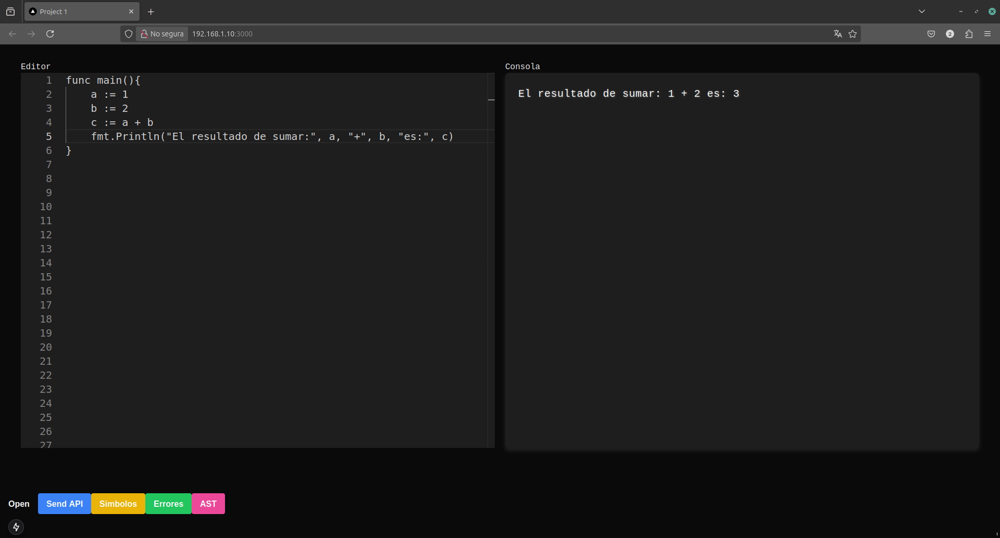
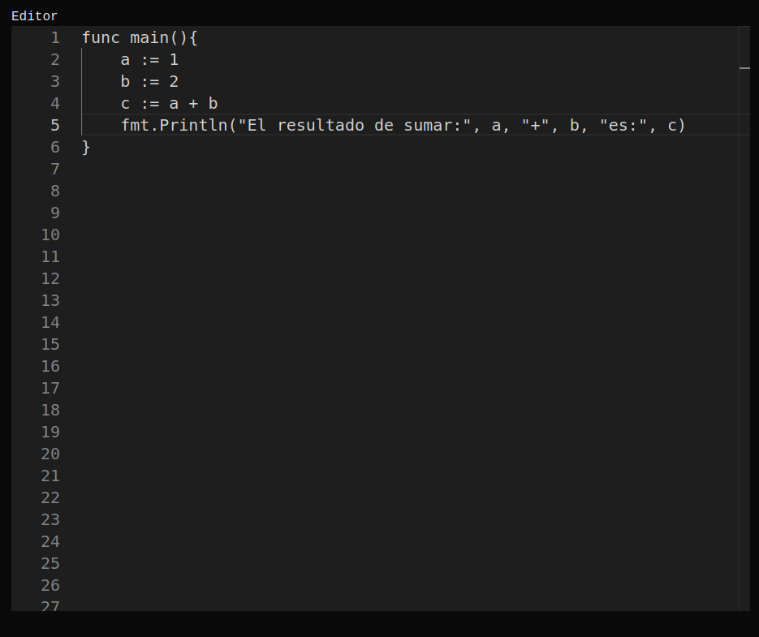
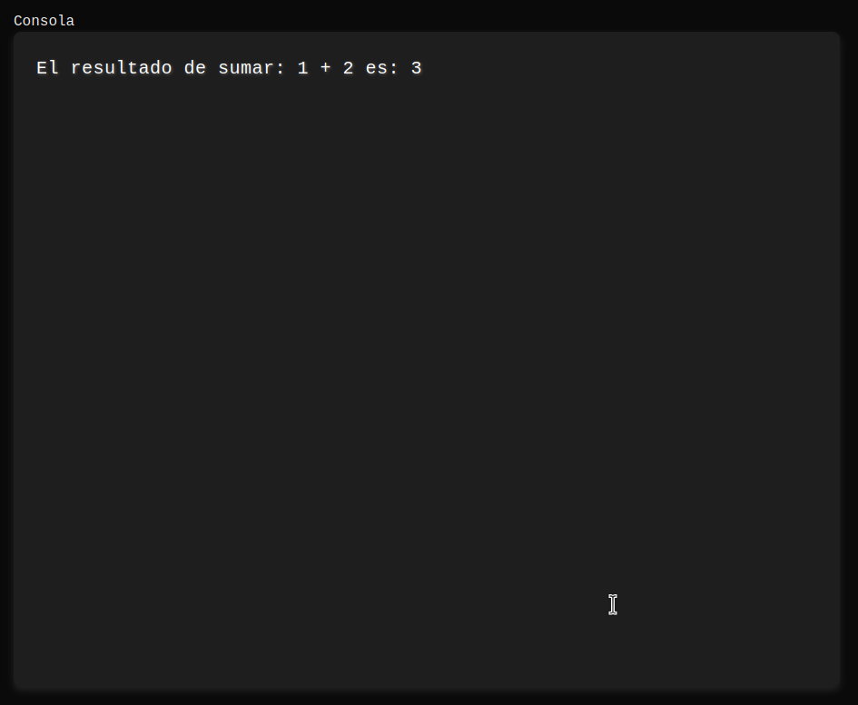
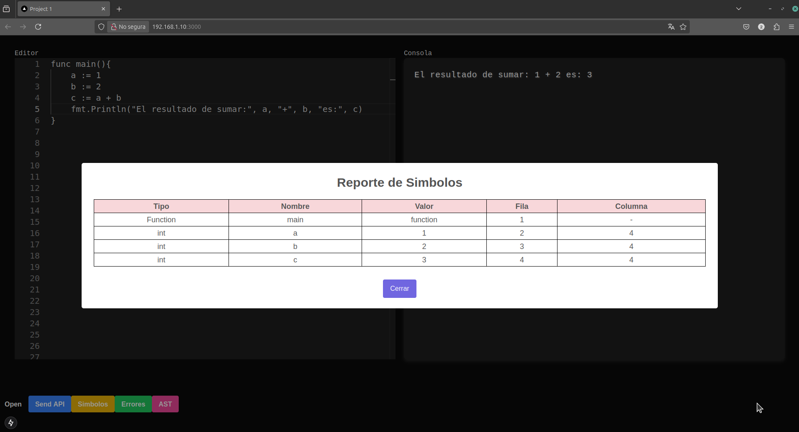
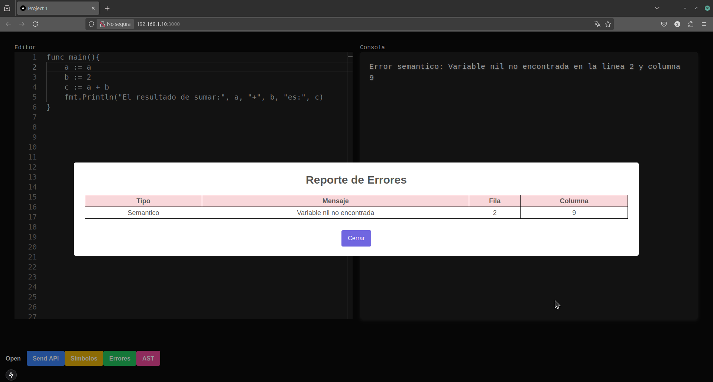

# Documentación usuario

## Requisitos previos

### Herramientas

 - .NET 9.0
 - node js
 - git

### Proceso de instalacion de herramientas
- Windows: Por lo regular instalar estas herramientas es bastante facil de realizar solo se debe descargar los ejecutables correctos.
    - .NET 9.0 
    - node js
    - git

- Linux: Se necesita un poco mas de configuracion y guardar variables de entorno para:
    - .NET 9.0
    - node js
    - git

## Configuración inicial

- Clonar repositorio publico en una carpeta cualquiera

```
git clone https://github.com/fernandofalla/OLC2_Proyecto1_201700700.git
```

- Situarse en la raiz del proyecto

- Para ejecutar la parte visual se debe situar en **frontend** debera abrir un consola por lo regular tanto en windows como linux en el menu desplegable se puede seleccionar **abrir en una terminal**

```
cd frontend
npm run dev
```

Se ejecutar la parte visual y generara un enlace o url que podra acceder a traves de un navegador web.

- Para ejecutar el procesador se debe situar en **backend** debera abrir una consola nuevamente que por lo general tanto en windows como linux lo permite a traves del menu desplegable al hacer clic derecho

```
cd backend
dotnet watch run
```

## Uso

Al ingresar a la url se mostrara la aplicación **GoLight**



---

### Componentes

 - Editor de codigo
 - Consola para visualizacion de respuestas
 - Botones de funcionalidad

#### Editor de codigo



#### Consola para visualizacion de respuestas



#### Botones de funcionalidad


### Funcionalidades
 - Abrir archivo
 - Ejecutar archivo
 - Mostrar simbolos
 - Mostrar errores
 - Mostrar AST

#### Ejecutar archivo


#### Mostrar simbolos



#### Mostrar errores

